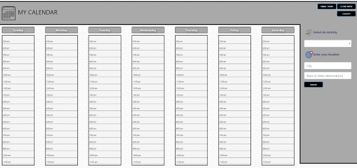
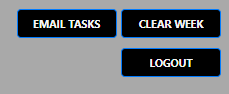
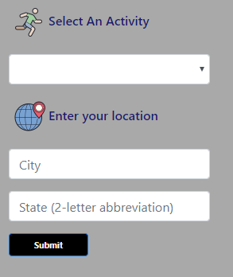

# MY CALENDAR    

-----------------------------------
### Description of My Calendar  
A full stack web application that allows a user to view his or her weekly calendar.  The user is able to enter personal
events into a dynamically updating calendar.  The user can also access the ticketmaster API to view concerts or sporting
events in his or her area.  The user can also access the National park service API to view federal and state parks in his or 
her area.  The user can also access the Zomato API to find restaurants in a specific locale.  Each of the suggested events 
can be dynamically added to the user's dynamically updating calendar.

## Main View

Users are able to emails themselves their current calendar view, clear their week, or logout and go back to the login page

Users are also able to select and activity out of the prepopulated list or add a customized event to their calendar

## Technologies Used:
- Bootstrap 4 (Front-end framework)
- Express.js (Server framework)
- Heroku (Cloud platform)
- JawsDb (Remote Database)
- MySQL (Database)
- Node.js (Javascript environment)
- Sequelize (ORM)

## API's Accessed:
- Google Geocoding API
- Ticketmaster API
- Zomato API
- National Parks Service API

### Developers
- Mike Lang 
- Douglas C. Mueller

## [Deployed Site](https://shrouded-hollows-79683.herokuapp.com/)